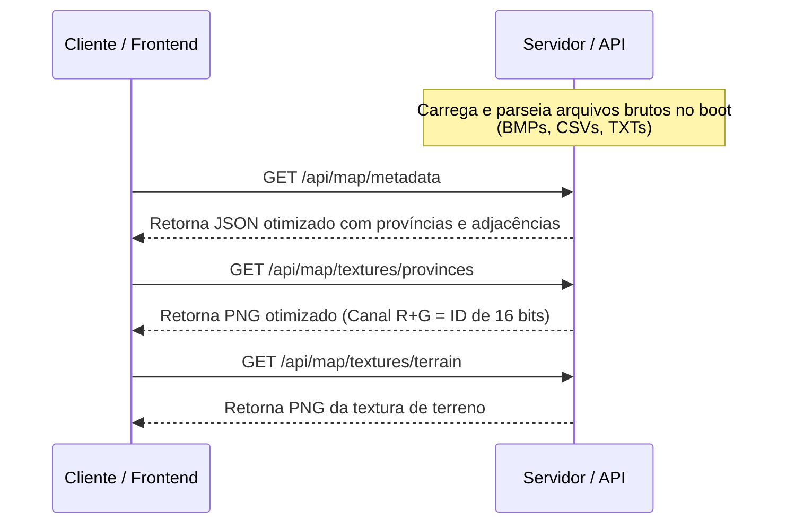

# Contratos de API e Protocolo de Rede: The Map Game

Este documento especifica a interface de comunicação (HTTP e WebSocket) entre o cliente e o servidor de jogo utilizando o Colyseus.

---

## 1. REST API: Carga e Otimização do Mapa (Novidade)

Para evitar que o cliente baixe e processe arquivos brutos pesados (como o `provinces.bmp` de 36MB), o back-end realiza o parsing do mapa no startup e serve os dados processados e otimizados via requisições HTTP REST normais antes da conexão WebSocket.



### 1.1 `GET /api/map/metadata`
Retorna todos os dados relacionais das províncias e a topologia do mapa necessários para a construção do grafo de adjacência e UI no frontend.
- **Resposta (JSON):**
  ```json
  {
    "dimensions": {
      "width": 5632,
      "height": 2048
    },
    "provinces": [
      {
        "id": 1,
        "name": "Stockholm",
        "color": { "r": 45, "g": 120, "b": 200 },
        "isWater": false,
        "terrain": "woods",
        "climate": "temperate",
        "continent": "europe",
        "region": "scandinavia"
      }
    ],
    "adjacencies": [
      { "from": 1, "to": 2, "type": "land" },
      { "from": 2, "to": 3, "type": "sea", "through": 1200 }
    ]
  }
  ```

### 1.2 `GET /api/map/textures/provinces`
Retorna a imagem com os IDs das províncias codificados em seus pixels.
- **Formato Otimizado:** PNG de 8-bit ou 16-bit.
- **Como funciona:** O servidor converte a cor RGB original do `provinces.bmp` para o ID numérico correspondente (obtido do `definition.csv`). Ele grava esse ID nos canais da imagem (ex: Canal Vermelho = `ID & 0xFF`, Canal Verde = `(ID >> 8) & 0xFF`).
- **Vantagem:** O arquivo final em PNG comprimido sem perdas é drasticamente menor do que os 36MB do BMP original (geralmente < 2MB), economizando banda e removendo o parser de BMP do client-side.

### 1.3 `GET /api/map/textures/terrain`
Retorna a textura de terreno indexada.
- **Formato:** PNG comprimido de 8 bits.
- **Vantagem:** O cliente pode carregar diretamente como uma textura do Three.js sem ler arquivos `.bmp` brutos.

---

## 2. Conexão Multiplayer (WebSocket)

Após carregar o mapa via REST, o cliente inicia a conexão WebSocket com a sala de jogo:

- **Endereço do Servidor:** `ws://localhost:2567`
- **Nome da Sala:** `global_map`
- **Parâmetros de Conexão (Auth):**
  ```json
  {
    "token": "string"
  }
  ```

---

## 3. Mensagens: Cliente ➔ Servidor (Ações do Jogador)

### 3.1 `move_army`
Solicita a movimentação de um exército até o alvo.
- **Payload:**
  ```json
  {
    "armyId": "string",
    "target": 123
  }
  ```

### 3.2 `declare_war`
Declara guerra contra outro país.
- **Payload:**
  ```json
  {
    "target": "BRA"
  }
  ```

### 3.3 `recruit_army`
Recruta novas tropas em uma província controlada pelo jogador.
- **Payload:**
  ```json
  {
    "provinceId": 45,
    "size": 1000
  }
  ```

### 3.4 `upgrade_province`
Desenvolve economicamente a província.
- **Payload:**
  ```json
  {
    "provinceId": 12
  }
  ```

---

## 4. Mensagens: Servidor ➔ Cliente (Eventos Ad-Hoc)

### 4.1 `server_notification`
- **Payload:**
  ```json
  {
    "title": "Guerra Declarada!",
    "text": "O Império Francês declarou guerra contra o Reino Unido!"
  }
  ```

### 4.2 `battle_result`
- **Payload:**
  ```json
  {
    "provinceId": 115,
    "winner": "FRA",
    "loser": "GBR",
    "survivingForce": 3450
  }
  ```

---

## 5. Estado Compartilhado (Colyseus Schema)

### `GameState` (Estado da Sala)
```typescript
class GameState extends Schema {
  @type('number') tick: number;
  @type('string') inGameDate: string;
  @type({ map: ProvinceState }) provinces;
  @type({ map: PlayerState }) players;
  @type({ map: ArmyState }) armies;
}
```

### `ProvinceState`
```typescript
class ProvinceState extends Schema {
  @type('string') owner: string;
  @type('number') development: number;
  @type('boolean') isUnderSiege: boolean;
}
```

### `PlayerState`
```typescript
class PlayerState extends Schema {
  @type('string') name: string;
  @type('string') tag: string;
  @type('number') gold: number;
  @type('number') manpower: number;
}
```

### `ArmyState`
```typescript
class ArmyState extends Schema {
  @type('string') id: string;
  @type('string') owner: string;
  @type('number') size: number;
  @type('number') provinceId: number;
  @type('number') targetProvinceId: number;
  @type('number') progressPercent: number;
}
```
