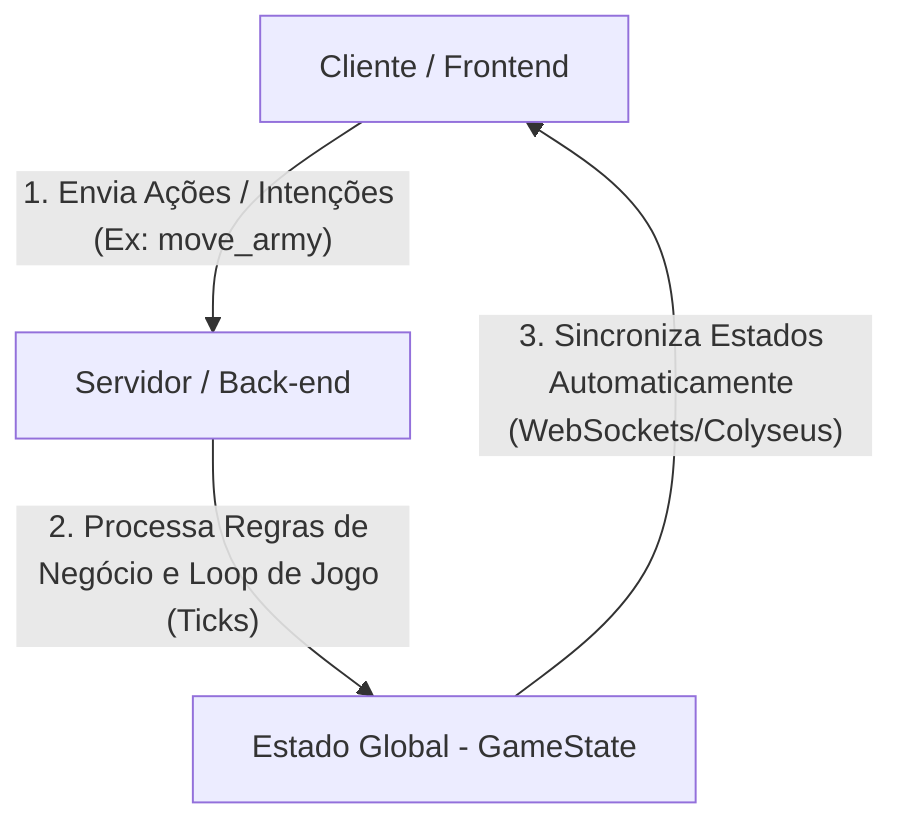

# Contexto do Projeto: The Map Game (Back-end)

Este documento define o contexto, as diretrizes e a estrutura inicial para o desenvolvimento do back-end do **The Map Game**.

O projeto é um jogo multiplayer online de estratégia global (*Grand Strategy*) em tempo real, jogado em um globo 3D interativo. O principal pilar arquitetural é que o **servidor é a autoridade máxima do estado de jogo (Server-Authoritative)**.

---

## 1. Visão Geral da Arquitetura

O fluxo de dados segue um modelo estritamente reativo:

1. **Cliente (Frontend):** 
   - Renderiza visualmente o globo 3D (Three.js) e as províncias usando dados pré-processados e texturas otimizadas servidos pela REST API do back-end, além de consumir o estado em tempo real recebido via WebSocket.
   - Captura eventos do jogador (clique, ações) e os envia ao servidor como mensagens estruturadas (ex: `move_army`).
   - Não realiza previsões locais de estado (client-side prediction) para mecânicas críticas (movimentação, conquistas).
2. **Servidor (Back-end):**
   - Carrega e parseia os dados geográficos e políticos originais do mapa (`provinces.bmp`, `definition.csv`, `adjacencies.csv`, etc.).
   - Constrói o grafo de adjacências e mapeia metadados das províncias na memória.
   - Serve esses dados em formatos compactados e otimizados para o frontend (reduzindo arquivos de 36MB para PNGs leves de < 2MB).
   - Executa o loop do jogo (geração de recursos, movimentação de exércitos em ticks de tempo, resolução de cercos e batalhas).
   - Valida cada ação recebida do cliente antes de modificar o estado da partida.

---

## 2. Stack Tecnológica Recomendada

Para garantir máxima performance, compartilhamento de tipos e facilidade de manutenção com o frontend:

- **Runtime:** [Bun](https://bun.sh/) (já adotado no frontend, ideal pela velocidade e suporte nativo a TypeScript).
- **Linguagem:** TypeScript (permite compartilhar interfaces de tipos e regras de schemas diretamente entre `web/` e `backend/`).
- **Framework de Multiplayer:** [Colyseus](https://colyseus.io/) (utiliza WebSockets otimizados com sincronização de estado baseada em deltas e schemas binários).

---

## 3. Servidor como Pipeline de Otimização do Mapa (Clausewitz Pipeline)

Ao invés de delegar o processamento pesado de arquivos BMP e CSV para o cliente (o que causaria gargalos de CPU e downloads massivos no navegador), o servidor assume a responsabilidade de parsear e expor apenas o necessário para renderização:

### Processamento do Servidor no Startup:
1. **Leitura e Construção do Grafo:**
   - Lê `definition.csv` para registrar todas as províncias por ID, nome e cor original.
   - Lê `adjacencies.csv` e calcula as fronteiras de pixels de `provinces.bmp` para gerar um grafo completo de conexões de províncias.
   - Lê `default.map` para identificar as províncias que iniciam como mar/oceano.
2. **Geração de Texturas Otimizadas:**
   - Cria e expõe uma textura comprimida em PNG onde a cor de cada pixel corresponde diretamente ao ID numérico da província (ex: canais de cores R e G codificando o ID de 16 bits). Isso elimina o bitmap bruto de 36MB no cliente.
3. **Distribuição via REST API:**
   - O servidor expõe endpoints HTTP para que o frontend baixe o JSON de metadados das províncias e as texturas prontas para injeção na GPU (Three.js), reduzindo drasticamente o tempo de carregamento inicial.

---

## 4. Estrutura do Estado de Jogo (Schemas)

No Colyseus, o estado da sala é definido por classes anotadas que sincronizam deltas binários. O estado no servidor deve refletir os tipos definidos em `web/src/game/types/state.d.ts`:

- **`GameState`** (Estado Global da Sala):
  - `tick` (número atual da simulação)
  - `inGameDate` (data fictícia do jogo, ex: `"1444-11-11"`)
  - `provinces` (Dicionário indexado por ID com `ProvinceState`)
  - `players` (Dicionário indexado por SessionID com `PlayerState`)
- **`ProvinceState`**:
  - `owner` (Tag do país/jogador que controla a província)
  - `development` (Nível de desenvolvimento econômico)
  - `isUnderSiege` (Define se a província está sendo cercada por um exército rival)
- **`PlayerState`**:
  - `name` (Nome do usuário)
  - `gold` (Quantidade atual de moedas)
  - `manpower` (Quantidade de força de trabalho/soldados recrutáveis)

---

## 5. Próximos Passos de Planejamento

Recomendamos a criação dos seguintes arquivos de planejamento adicionais nesta pasta:

1. **`ARCHITECTURE.md`**: Detalhamento da organização de diretórios do back-end, serviços e injeção de dependências.
2. **`GAMEPLAY_LOOP.md`**: Definição detalhada dos timers de tick, mecânica de movimentação de exércitos, cálculo de combate e sieges.
3. **`API_CONTRACTS.md`**: Definição das mensagens WebSocket (ações de cliente e respostas de servidor) e payloads esperados.

Você gostaria de prosseguir configurando o esqueleto básico do projeto no Bun ou prefere criar os demais arquivos de planejamento em markdown primeiro?
