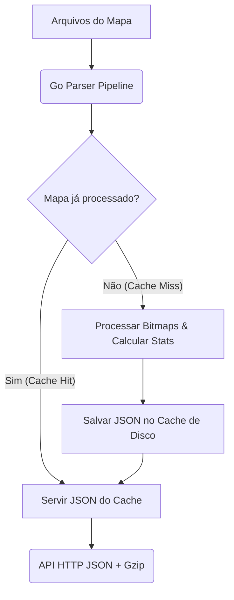

# Especificação Técnica: Parsing de Mapa e Backend em Go

Este documento detalha como o backend em **Go** deve processar os arquivos de mapas (estilo Clausewitz/Paradox) e expor a API que o frontend do jogo de mapa espera consumir.

---

## 1. Visão Geral da Arquitetura

O frontend foi desacoplado de qualquer lógica de decodificação de imagem ou cálculo geométrico pesado. A responsabilidade do backend é:
1. **Ler e parsear** os arquivos de definição e de imagem.
2. **Computar buffers de ID e estatísticas** de províncias (bounding boxes, centroides, contagem de pixels).
3. **Determinar o terreno predominante** de cada província combinando o mapa de províncias com o mapa de terrenos.
4. **Cachear** as respostas processadas para evitar parsing redundante (já que os bitmaps podem ter mais de 5000x2000 pixels).
5. **Servir uma API JSON** de alta performance com compressão.



---

## 2. Arquivos de Entrada (Inputs)

O parser consome uma pasta de definição do mapa contendo:

1. **`definitions.json`**
   - Contém a lista de províncias mapeando cores RGB para ID e Nome, e a lista de adjacências.
2. **`default.map`**
   - Arquivo de texto simples definindo metadados básicos como `max_provinces`, lista de `sea_starts` e caminhos relativos dos outros arquivos.
3. **`provinces.bmp`**
   - Imagem BMP de 24 bits (RGB sem compressão). Cada pixel tem a cor da província correspondente.
4. **`terrain.bmp`** (Opcional)
   - Imagem BMP geralmente indexada (8 bits) ou RGB, onde o canal vermelho (ou índice de paleta) representa o tipo de terreno.
5. **`terrain.json`** (Opcional)
   - Define a tabela de tipos de terreno (`categories`), regras de `overrides` de terreno manuais e o mapa `indexToTerrain` (que mapeia o byte lido em `terrain.bmp` para um nome de categoria).
6. **`regions.json`** (Opcional)
   - Agrupamento lógico de províncias em regiões (ex: `{"region_name": [1, 2, 3]}`).
7. **`continents.json`** (Opcional)
   - Agrupamento de províncias em continentes (ex: `{"europe": [1, 2, 3]}`).

---

## 3. Fluxo de Parsing no Backend (Go)

### Passo 1: Parsear Arquivos de Configuração e Texto
* **`definitions.json`**: Ler e decodificar para estruturas Go.
* **`default.map`**: Parsear o formato de chave-valor simples para extrair os nomes dos arquivos BMP e configurações.
* **`terrain.json` / `regions.json` / `continents.json`**: Ler como JSON padrão.

### Passo 2: Decodificar Bitmaps (`provinces.bmp`)
* Bitmaps de província costumam ser grandes (ex: `5616 × 2160`). Em Go, use o pacote `image/bmp` ou implemente um parser de stream otimizado se precisar economizar memória.
* **Atenção**: Como BMPs são armazenados de baixo para cima (bottom-up) na vertical, certifique-se de que a leitura Y reflita a orientação correta esperada pelo Three.js/WebGL (geralmente Y=0 é o topo no canvas, mas no BMP Y=0 é a base). Certifique-se de alinhar o sistema de coordenadas.

### Passo 3: Gerar Buffer de IDs (`idBufferResult`) e Estatísticas (`stats`)
Para cada pixel da imagem em coordenadas `(x, y)`:
1. Obtenha a cor RGB `(r, g, b)`.
2. Procure no mapa de províncias qual ID corresponde a essa cor RGB.
3. Se não houver correspondência, incremente `orphanPixelCount`.
4. Armazene o ID da província no buffer unidimensional de tamanho `width * height`.
   * **Tipo do Buffer**: No Go, represente como um array ou fatia de inteiros de 16 bits (`[]uint16`).
5. Calcule/Atualize as estatísticas da província (`ProvinceStats`):
   * `pixelCount`: Total de pixels acumulados.
   * `minX`, `minY`: Mínimo `x` e `y` encontrados (para bounding box).
   * `maxX`, `maxY`: Máximo `x` e `y` encontrados.
   * `sumX`, `sumY`: Soma dos valores de `x` e `y` (para cálculo do centroide: `centerX = sumX / pixelCount`).

### Passo 4: Calcular Terrenos Predominantes
Se o `terrain.bmp` estiver presente:
1. Para cada pixel `i` de `0` até `width * height`:
   * Obtenha o ID da província no índice correspondente (`idBuffer[i]`).
   * Obtenha o valor da cor/índice em `terrain.bmp[i]`.
   * Converta o índice do terreno usando `indexToTerrain` para obter a string do tipo de terreno (ex: `"plains"`, `"forest"`).
   * Acumule os votos de tipo de terreno para essa província.
2. Para cada província, determine qual terreno teve o maior número de pixels.
3. Se a província não tiver um override manual (`overrides[provinceId]`), grave o tipo de terreno mais frequente no objeto de `overrides` que será retornado no JSON.

---

## 4. Cache de Mapas (Alta Performance)

O processo acima consome muita CPU e memória (processamento de imagens grandes). Portanto, o backend **deve implementar cache persistente em disco**:

1. **Identificador único do mapa**: Use o nome do mapa ou faça o hash MD5/SHA256 dos arquivos de entrada (`provinces.bmp` + `definitions.json`).
2. **Salvamento no disco**:
   * Uma vez calculado o JSON final `ParsedMapData`, grave-o comprimido em uma pasta de cache (ex: `.cache/maps/[hash].json.gz`).
3. **Carregamento rápido**:
   * Quando uma requisição de mapa chegar, verifique se `.cache/maps/[hash].json.gz` existe.
   * Se existir, leia, descomprima e envie diretamente para o cliente, ignorando todo o processo de parsing de imagem.
4. **Cache em memória (Opcional - Hot Cache)**:
   * Para mapas muito requisitados, armazene o JSON decodificado ou comprimido em memória RAM (`sync.Map` ou Redis) para latência zero.

---

## 5. Estrutura de Resposta da API (JSON)

O frontend espera receber os dados com o seguinte formato exato (definido em `ParsedMapData` do arquivo `src/types/data.d.ts`):

```json
{
  "defaultMap": {
    "maxProvinces": 3380,
    "seaStarts": [1, 2, 10, 15]
  },
  "provinces": {
    "255,0,0": {
      "id": 1,
      "color": [1.0, 0.0, 0.0],
      "name": "Lisboa"
    }
  },
  "provinceById": {
    "1": {
      "id": 1,
      "color": [1.0, 0.0, 0.0],
      "name": "Lisboa"
    }
  },
  "adjacencies": [
    {
      "from": 1,
      "to": 2,
      "type": "land"
    }
  ],
  "terrain": {
    "paletteSize": 64,
    "categories": {
      "plains": { "name": "Planície", "color": [0.5, 0.8, 0.5], "isWater": false }
    },
    "overrides": {
      "1": "plains"
    },
    "indexToTerrain": {
      "0": "plains"
    }
  },
  "regions": {
    "iberia": [1, 2, 3]
  },
  "continents": {
    "europe": [1, 2, 3]
  },
  "provincesBitmapUrl": "/api/maps/current/provinces.bmp",
  "terrainBitmapUrl": "/api/maps/current/terrain.bmp",
  "idBufferResult": {
    "idBuffer": [1, 1, 1, 2, 2, 3], 
    "maxProvinceId": 3,
    "orphanPixelCount": 0,
    "foundIds": [1, 2, 3],
    "stats": {
      "1": {
        "id": 1,
        "pixelCount": 3,
        "sumX": 3,
        "sumY": 0,
        "minX": 0,
        "minY": 0,
        "maxX": 2,
        "maxY": 0
      }
    }
  }
}
```

> [!NOTE]
> O array `idBuffer` deve ser serializado como uma lista de inteiros simples em JSON. O frontend irá convertê-lo automaticamente em um `Uint16Array` após o recebimento.

> [!IMPORTANT]
> Certifique-se de habilitar compressão **Gzip ou Brotli** nos endpoints de API do Go, pois o `idBuffer` para um mapa 5616x2160 conterá mais de 12 milhões de elementos e a compressão reduzirá drasticamente o tráfego de rede (redução de ~95%).
